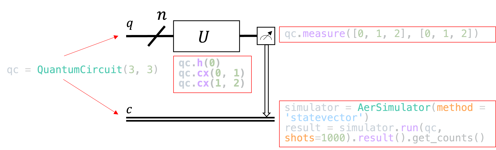
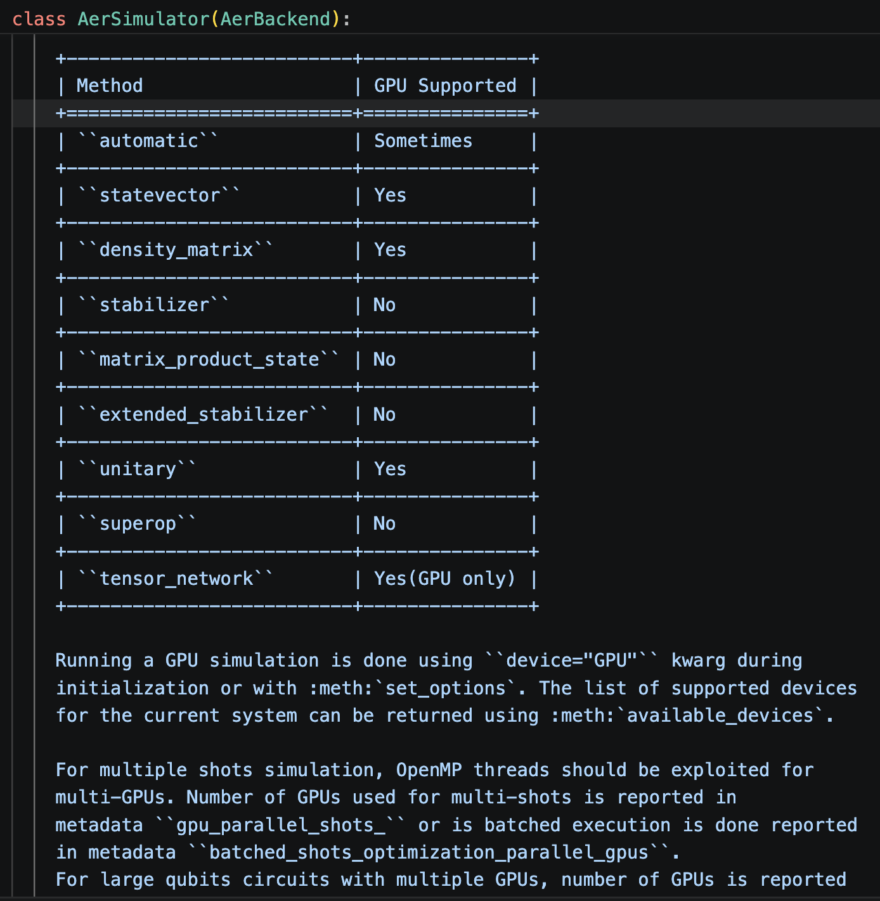
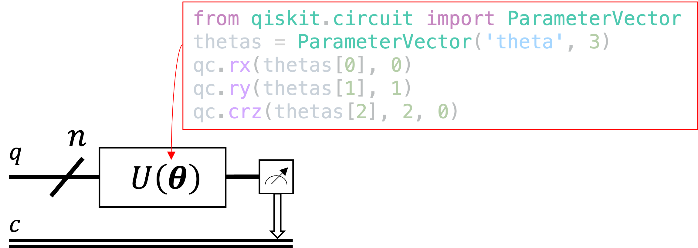
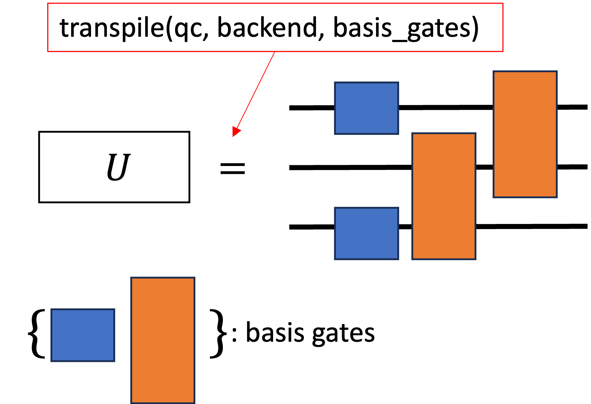
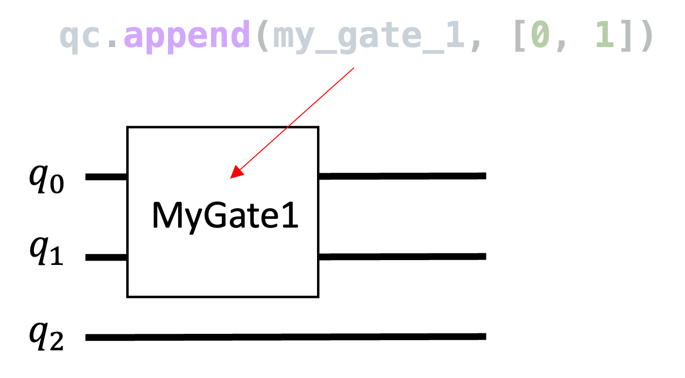
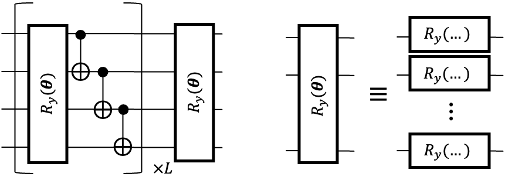

# Qiskit

| Package | Version |
| -------- | -------- |
qiskit     |       1.4.5
qiskit-aer |      0.17.2
qiskit-algorithms | 0.4.0


## 1. Một quantum circuit hoàn chỉnh, có quantum register, classical register, measurement, device.

1.1. Đo bằng Sampler



1.2. Đo bằng Estimator

$p_{000} = \langle\psi | 000 \rangle \langle 000 |\psi\rangle = |\langle 000 |\psi\rangle|^2$
Để tạo ra được $|000\rangle$, ta sử dụng $(I+Z)/2$ cho mỗi qubit. 

Trong Qiskit, thứ tự qubit trong chuỗi Pauli là $q_2 q_1 q_0$

$|000\rangle\langle 000|=(\frac{I+Z}{2})\otimes(\frac{I+Z}{2})\otimes(\frac{I+Z}{2})$


## 2. Backend

Tất cả các quantum circuit đều cần chạy trên một "backend", "backend" chính là cơ chế chạy trên hardware thật hoặc mô phỏng, có các loại mô phỏng như bên dưới (một số giải thuật song song hoá được)



## 3. Mạch có "tham số" $\bm\theta=[\theta_0\;\theta_1\ldots\theta_{m-1}]^{\intercal}$
Lưu ý: $\forall \theta_j\in\bm\theta, 0\leq\theta_j\leq2\pi$.



## 4. Mạch được transpile



## 5. Thêm một cổng "handmade"



## 6. Tạo Hardware-Efficient "ansatz"



## 7. Tính "gradient" trên Hardware-Efficient "ansatz" có $m$ parameter.

$\nabla C(\bm\theta)=[\frac{\partial C(\bm\theta)}{\partial \theta_0}\;\frac{\partial C(\bm\theta)}{\partial \theta_1}\;\ldots\;\frac{\partial C(\bm\theta)}{\partial \theta_{m-1}}]$

$C(\bm\theta)=\langle \psi(\bm\theta) | \hat{H} | \psi(\bm\theta) \rangle$

$\frac{\partial C(\bm\theta)}{\partial \theta_j} \approx \frac{\langle \psi(\bm\theta + \epsilon e_j) | \hat{H} | \psi(\bm\theta + \epsilon e_j) \rangle - \langle \psi(\bm\theta - \epsilon e_j) | \hat{H} | \psi(\bm\theta - \epsilon e_j) \rangle}{2\epsilon}
$

$\epsilon\approx 0, e_j$ là vector đơn vị thứ $j$.

## (Bài tập) 8. Sử dụng gradient để "optimize"

Mục tiêu: tìm $\bm\theta^*$ sao cho $C(\bm\theta^*)\leq C(\bm\theta)\;\forall \bm\theta$, đơn giản hơn: giá trị $C(\bm\theta^*)$ đạt min.

Với $\hat{H}=XX+1/2ZI-3ZX$, Hardware-Effecient ansatz (2 qubit, 2 layer), $|\psi_0\rangle=|00\rangle$.

Bằng optimizer Gradient Descent: $\bm\theta^{t+1}\leftarrow\bm\theta^t-\alpha\nabla_C(\bm\theta^{t})$, chạy với $t$ tăng dần cho đến khi nào $C(\bm\theta^t)<\tau$ nào đó.

```
T_max = 100
for t in range(0, T_max):
   thetas = thetas - alpha*gradient(\thetas)
```


---

*Tham khảo:*

